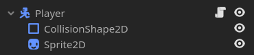
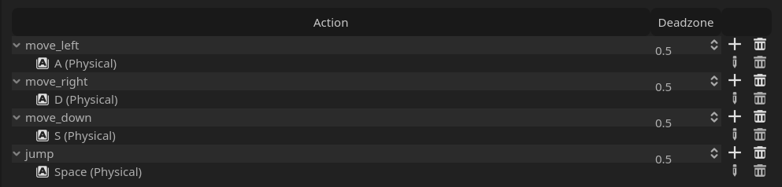
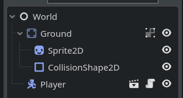
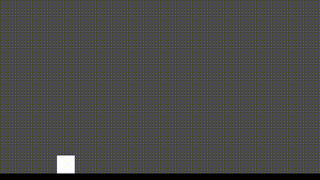

# Drop-Down Platforms for Godot 4

This tutorial walks you through the process of implementing drop-down platforms, a common feature in platformer games, using Godot's built-in features and scripting.

## Overview

Drop-down platforms are platforms that exhibit two main mechanics:

1. **Falling Down:** The player can fall through the platform when pressing the input key(s).
2. **Ignoring Collision:** The platform allows the player to pass through it when jumping up from beneath.

## Getting Started

To follow along with this tutorial, make sure you have Godot Engine installed on your system. If not, you can download it [here](https://godotengine.org/download).

### Step 1: Setting Up the Player



I have used the built-in template that comes along with Godot's `CharacterBody2D`, with a few customizations, including a slightly increased jump force, and custom input mappings.

```gdscript
extends CharacterBody2D

const SPEED = 300.0
const JUMP_VELOCITY = -500.0

# Get the gravity from the project settings to be synced with RigidBody nodes.
var gravity = ProjectSettings.get_setting("physics/2d/default_gravity")


func _physics_process(delta):
	# Add the gravity.
	if not is_on_floor():
		velocity.y += gravity * delta

	# Handle jump.
	if Input.is_action_just_pressed("jump") and is_on_floor():
		velocity.y = JUMP_VELOCITY

	# Get the input direction and handle the movement/deceleration.
	var direction = Input.get_axis("move_left", "move_right")
	if direction:
		velocity.x = direction * SPEED
	else:
		velocity.x = move_toward(velocity.x, 0, SPEED)

	move_and_slide()
```

The input map is just 4 basic actions.



### Step 2: Creating A Simple Level To Navigate

Let's make a simple platform for the player to move on.

The level is a `Node` called World to act as the root of the scene with the rest of the environment as children. For the sake of simplicity, I have used a `StaticBody2D` node as a direct child of the World to behave as the ground.

Let us also drop in the `Player` scene as a child of the World.



With this, we can observe our player moving around the level.


<!-- 

### Step 2: Enabling One-Way Collision

To allow the player to jump up through the platforms from beneath:

1. Enable "One Way Collision" for the platform colliders.

### Step 3: Implementing Drop-Down Platform Mechanics

Now, let's dive into scripting to implement the drop-down platform mechanics:

1. **Identifying Drop-Down Platforms:** Utilize Godot's group feature to distinguish between different types of platforms.
2. **Falling Down:** Implement the falling down mechanic using one of the available approaches (e.g., turning off the platform's collider).

### Step 4: Testing and Iterating

1. Test your implementation to ensure that the drop-down platforms work as intended.
2. Experiment with different settings and mechanics to customize the behavior according to your game's requirements.

## Additional Resources

- [Godot Documentation](https://docs.godotengine.org/en/stable/)
- [Godot Community](https://godotengine.org/community)

## Contributing

Contributions are welcome! If you find any issues or have suggestions for improvements, feel free to open an issue or submit a pull request.

## License

This project is licensed under the MIT License - see the [LICENSE](LICENSE) file for details. -->
