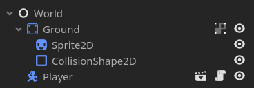
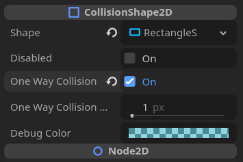

# Drop-Down Platforms for Godot 4

This tutorial walks you through the process of implementing drop-down platforms, a common feature in platformer games, using Godot's built-in features and scripting.

## Overview

Drop-down platforms are platforms that exhibit two main mechanics:

1. **Falling Down:** The player can fall through the platform when pressing the input key(s).
2. **Ignoring Collision:** The platform allows the player to pass through it when jumping up from beneath.

## Getting Started

To follow along with this tutorial, make sure you have Godot Engine installed on your system. If not, you can download it [here](https://godotengine.org/download).

### Step 1: Setting Up the Player


The player is a `CharacterBody2D` node, with a `CollisionShape2D` for the physics and a `Sprite2D` for the visual.

I have used the built-in script template that comes along with Godot's `CharacterBody2D`, with a few customizations, including a slightly increased jump velocity, and custom input mappings.

```gdscript
extends CharacterBody2D

const SPEED = 300.0
const JUMP_VELOCITY = -500.0

# Get the gravity from the project settings to be synced with RigidBody nodes.
var gravity = ProjectSettings.get_setting("physics/2d/default_gravity")


func _physics_process(delta):
	# Add the gravity.
	if not is_on_floor():
		velocity.y += gravity * delta

	# Handle jump.
	if Input.is_action_just_pressed("jump") and is_on_floor():
		velocity.y = JUMP_VELOCITY

	# Get the input direction and handle the movement/deceleration.
	var direction = Input.get_axis("move_left", "move_right")
	if direction:
		velocity.x = direction * SPEED
	else:
		velocity.x = move_toward(velocity.x, 0, SPEED)

	move_and_slide()
```

The input map is just 4 basic actions.


### Step 2: Creating A Simple Level To Navigate

Let's make a simple platform for the player to move on.

The level is a `Node` called World to act as the root of the scene with the rest of the environment as children. For the sake of simplicity, I have used a `StaticBody2D` node as a direct child of the World to behave as the ground. The ground has a `CollisionShape2D` and `Sprite2D` as children. 

Let us also drop in the `Player` scene as a child of the World.



With this, we can observe our player moving around the level.


## Drop-Down Platforms

### Step 1: Implementing One-Way Collision

For the drop-down platforms, I have used the same structure as the Ground node, i.e. a `StaticBody2D` with `CollisionShape2D` and `Sprite2D` as children.

One-Way Collision in Godot is fairly straightforward. In the Inspector panel of the `CollisionShape2D` node, you can toggle the `One Way Collision` property to turn on or off one-way collision. Godot by default has one-way collisions work from the bottom of the platform to the top.



With this, we can observe the player being able to pass through the platforms when jumping up from beneath.


### Step 2: Implementing Falling Down

###### Step 2.1: Collision Layers

This mechanic can be implemented in many different ways, but the most graceful approach would be to utilise Godot's Collision Layers and Masks.

Firstly, let us update the Player's `Collision` property in the Inspector panel and check the 2nd Layer `Mask` as well.


This makes it so that the Player will also check for collisions with any `PhysicsBody2D` on the 2nd collision layer.

Now on our drop-down platform, let us update the `Collision` property in the Inspector panel and uncheck all `Mask` layers as we don't need to have the drop-down platforms checking for collisions. Let us also uncheck the 1st `Layer` and check the 2nd `Layer`.


This setup makes it such that the collisions between the player and the drop-down platforms only occur in the 2nd layer.

###### Step 2.2: The Logic

As the collisions only happen in the 2nd layer, to disable collisions between the player and the drop-down platforms, we can simply just disable the player's collision mask for that layer, making this approach very convenient and easy to implement.

In the player script, we can add the following lines of code:

```gdscript
# Handle drop-down platforms
if Input.is_action_pressed("move_down"):
	set_collision_mask_value(2, false)
else:
	set_collision_mask_value(2, true)
```

Now when we press the `"move_down"` action, the player will no longer collide with the drop-down platforms as long as the key is held down, making this convenient for the player as well.

Below is the final player script:

```gdscript
extends CharacterBody2D


const SPEED = 300.0
const JUMP_VELOCITY = -500.0

# Get the gravity from the project settings to be synced with RigidBody nodes.
var gravity = ProjectSettings.get_setting("physics/2d/default_gravity")


func _physics_process(delta):
	# Add the gravity.
	if not is_on_floor():
		velocity.y += gravity * delta

	# Handle jump.
	if Input.is_action_just_pressed("jump") and is_on_floor():
		velocity.y = JUMP_VELOCITY

	# Get the input direction and handle the movement/deceleration.
	var direction = Input.get_axis("move_left", "move_right")
	if direction:
		velocity.x = direction * SPEED
	else:
		velocity.x = move_toward(velocity.x, 0, SPEED)

	# Handle drop-down platforms
	if Input.is_action_pressed("move_down"):
		set_collision_mask_value(2, false)
	else:
		set_collision_mask_value(2, true)

	move_and_slide()
```

We can now observe the player falling through the platforms when pressing the `"move_down"` action.


### Step 3: Reusability

Now that we've got the functionality implemented, we can make extract our drop-down platforms into a reusable scene. 

To achieve this, right click on the platform in the scene tree and click `Save Branch as Scene`. 


Now in the drop-down platforms scene, let's reset the transform of the platform to the origin. You can change the scale as well, if you wish.


This will make life easier when constructing levels. Now you can just drag and drop the platform into the scene tree for your level design.

And that's it! We have successfully implemented drop-down platforms in Godot 4!

## To End

As the implementation is simple, it is pretty easy to tinker with for your own specific use cases. If you have any questions or comments, feel free to contact me!

Happy coding!


## Additional Resources

- [Godot Documentation](https://docs.godotengine.org/en/stable/)
- [Godot Community](https://godotengine.org/community)

## License

This project is licensed under the MIT License - see the License file in the root directory of the repository for details.
