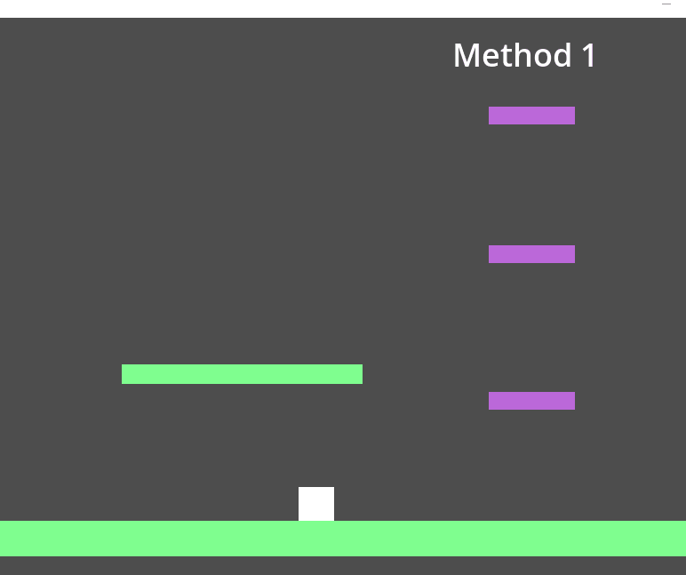

# Platform Pass Through in Godot 4.3 dev build 5

With Godot you can make a Platform Pass through mechanic in multiple ways. In this document I will show 2 ways one could impliment such a mechanic. The first I feel is the traditional way developers have done the drop down mechanic in the past. I however have made a slight adjustment in my second method that allows the player more freedom in level exploration. Each method has their own benifits and the developer should choose the method that fits the type of game they are trying to make.

# Platform Setup

No matter which method you choose in the end the platform to be passable the nodes must be set up with the following.


The collision shape for the platforms and player in this example we use both `layers` and `mask` values 1 and 2. If you choose to go with method 1 then you do not need to have `layer` and `mask` value 2 enabled. `Layer` and `mask` value 2 is specific to method 2 and is my prefered technique.


Specifically for the platforms make sure that `one way collision` is checked, and the `One way collision margin` is set to 1 pixel.


# Player Setup

The player will need to be setup in a similar way so that our character can collide with the platforms. For this demonstration both `layer` and `mask` values 1 and 2 are enabled. We will also use the pregenerated CharacterBody2D script that is generated in godot for basic movement and jumping. This will allow us to focus just on the Platform Pass Through mechanic.


## Method 1

For those just interested in copy and pasting the code here you go.

```
if (
    Input.is_action_pressed("ui_down") && Input.is_action_just_pressed("crouch") ||
    Input.is_action_just_pressed("ui_down") && Input.is_action_pressed("crouch") 
):
    self.position.y += 1
```
This block of code checks if the player has just pressed either `crouch` and `down` while the other key is already pressed. It is important to know that copying and pasting this code will not work as is, because in Godot I specified `crouch` as a special input to be `ctrl`. The developer will need to set this or something similar in their project settings, or bind this to a different key value.

If this check return true then the player will attempt to move themselves exactly 1 pixel downwards on the screen. Since our one way playforms have a tolerance of 1 pixel the player will pass right through the platform as shown.



A draw back to this method is the player can not rapidly drop through multiple floors. They have to wait until they land, or as a developer you will need to increase the y positional shift which may cause a stuttering effect. This is solved using Method 2.

## Method 2

For those just interested in copy and pasting the code here you go.

```
if (
    Input.is_action_pressed("ui_down") && Input.is_action_just_pressed("crouch") ||
    Input.is_action_just_pressed("ui_down") && Input.is_action_pressed("crouch") 
):
    self.set_collision_mask_value(2, false)
if Input.is_action_just_released("ui_down") || Input.is_action_just_released("crouch"):
    self.set_collision_mask_value(2, true)
```
This block of code disables the collision mask value 2 if the player has just pressed either `crouch` and `down` while the other key is already pressed. This allows the player to pass through any objects or platforms that are in collision mask 2. However because we disable the mask, whe need an additional check for when one of the two buttons are released. Once either is released we set the collision mask value 2 back to true.

Using this method we do not need to rely on shifting the player any distance, which allows them to fall more gracefully.  The following image shows how this method is similar to Method 1, but allows the player to rapidly transition through floors.


The reason I prefer this method is because I feel it is a nice quality of life to promote level navigation.