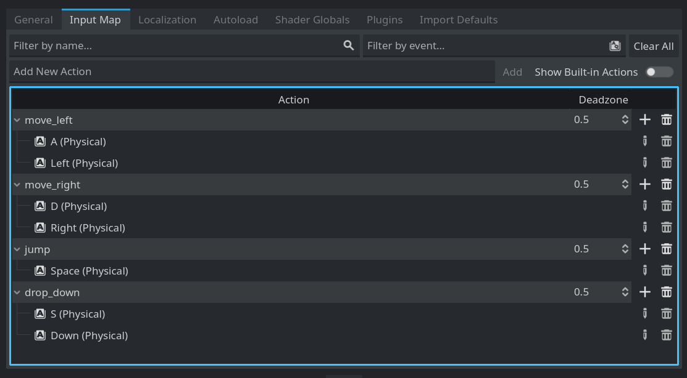
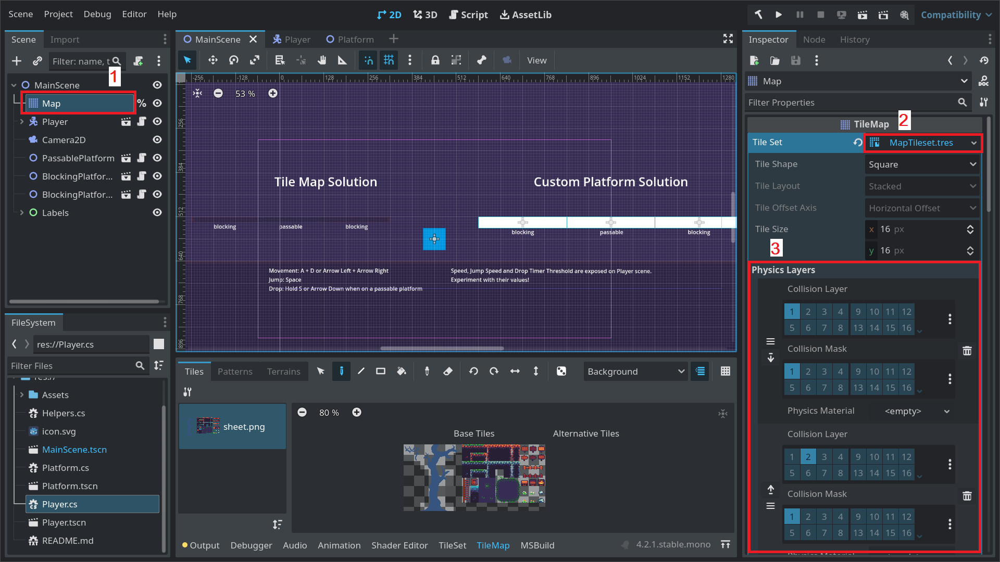
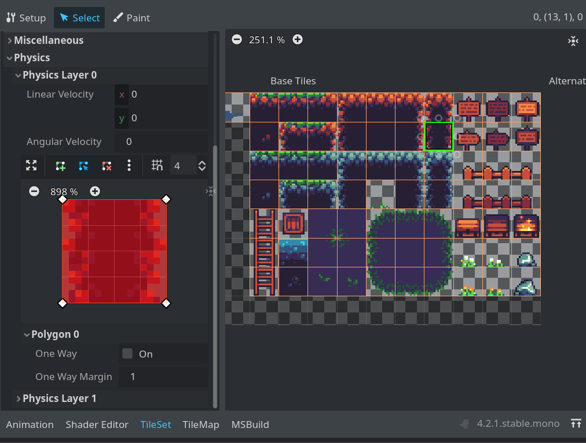
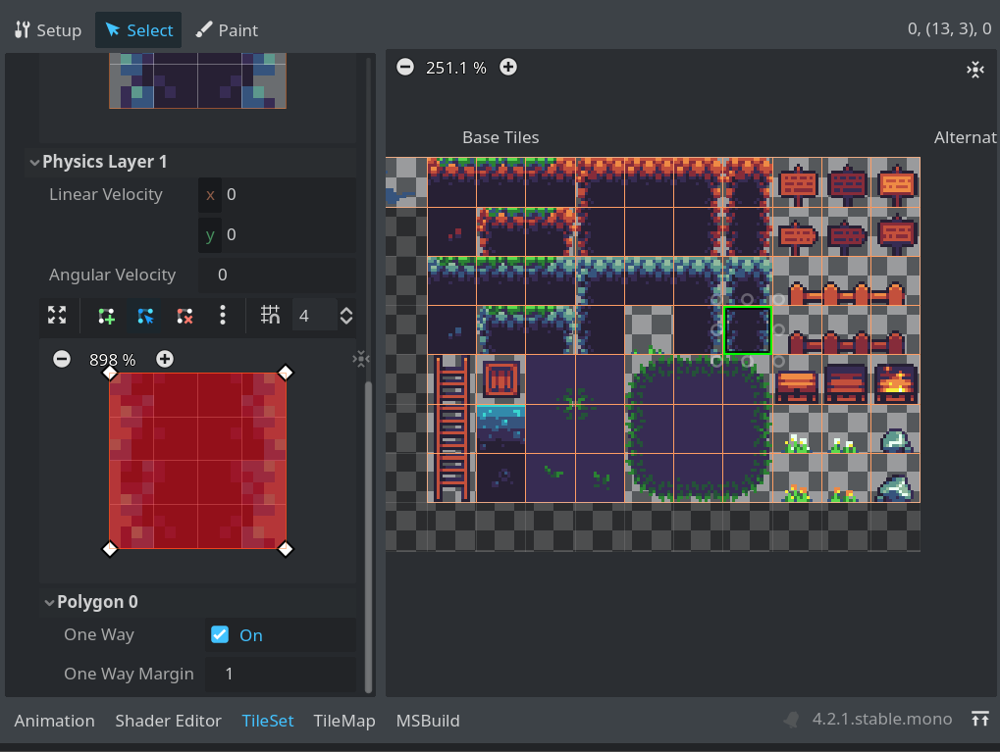
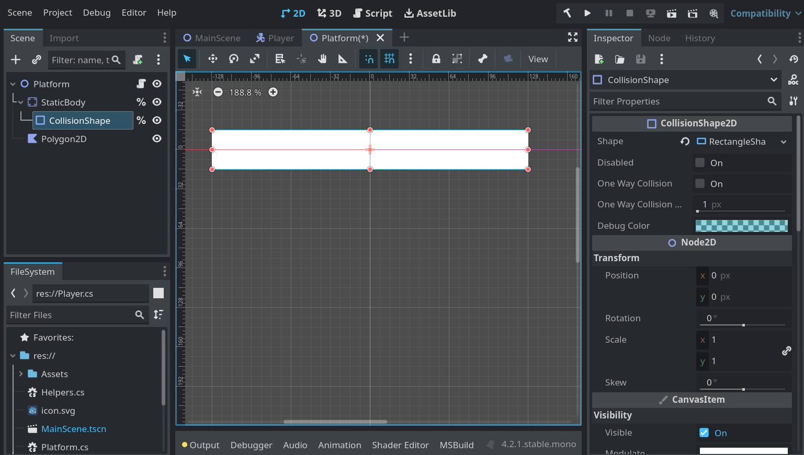
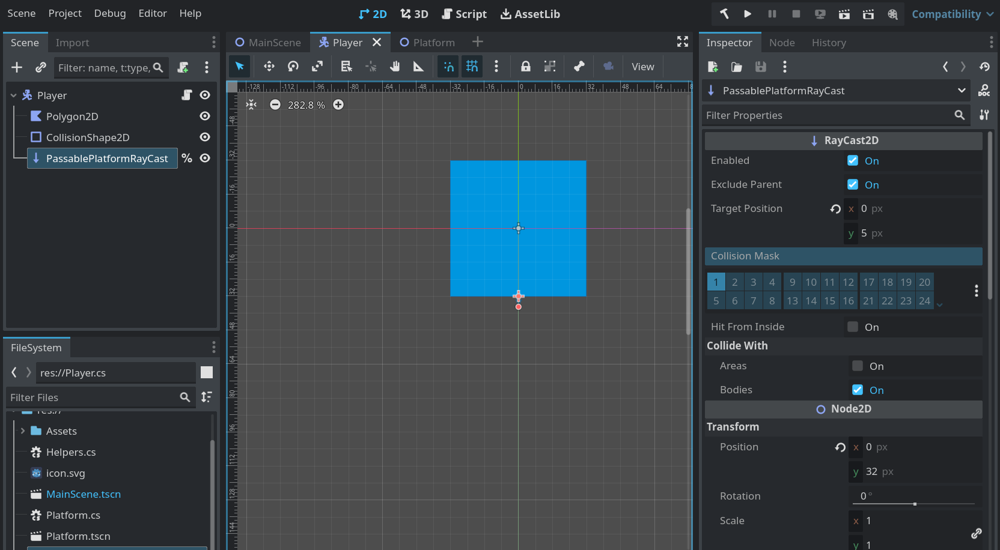

# Godot4/C# example of passable platforms

This is, as much as possible, a code-first solution, as there are not a lot of such approaches available. You can easily find solutions that set everything up in the Editor/Inspector, but then you are left out with figuring out how to manage that in more detail in code. So... here it is. 

## Introduction

### Blocking Platform

Typical map element that acts as a floor.

### Passable Platform

A map element that, besides the regular Blocking Platform function, can have one or both additional:
1. Allows to Drop Down after particular input action is issued while standing on it.
2. Allows to jump through it from below.

## Setup

### The Boring: Input Map

The only input relevant to the Drop Down mechanic is a single action `drop_down`.

All other actions are there only so we can move our character around.



### The World: Map and Platforms

The solution has two usages:
1. On a `Tile Map`, having some tiles acting as a Passable Platforms.
2. Outside of a Tile Map, using custom scenes for platforms.

#### Tile Map Setup


1. Add a `Tile Map`
2. Create or use existing `Tile Set`
3. Add two `Physics Layers`, one that has `Collision Layer` set to `1`, other with Collision Layer set to `2`. Masks are not relevant for the direction of interaction we'll be using.

##### Tile Set for Blocking tiles

1. Select a tile from the sheet that you want to act as a Blocking platform
2. Go to `Physics -> Physics Layer 0` (this references layer set on the Tile Map)
3. Select the collision shape for your tile 

##### Tile Set for Passable tiles

1. Select a tile from the sheet that you want to act as a Passable platform
2. Go to `Physics -> Physics Layer 1` (this references layer set on the Tile Map)
3. Select the collision shape for your tile
4. Expand `Polygon 0` and select `One Way`

#### Custom Platform Scene

Example uses simple `Static Body` With `Collision Shape 2D`.
Nothing crucial has to be set in the Inspector. Just make sure all the shapes are aligned correctly.


All the collision setup is done in the script (don't forget to attach it to your scene!). Here's the core part:
```csharp
	...
	
	// Analogous to character setup, here the platform's collision layers are set
	// The use of common const values makes sure we don't accidentally use wrong numbers
	platformBody.SetCollisionLayerValue(Consts.BLOCKING_PLATFORM_COLLISION_LAYER, !Passable);
	platformBody.SetCollisionLayerValue(Consts.PASSABLE_PLATFORM_COLLISION_LAYER, Passable);

	// This allows to jump through the platform from below
	platformCollision.OneWayCollision = Passable;

	...

```

### The Hero: You, controlling a Player character


The most important part in a Player scene is to position raycast correctly, at the bottom, where the contact with the platform is going to happen. The length can be short as we mostly want to detect a platform directly below us.

The core setup for a Player:
```csharp
	// Set the timer that acts as a "you have to hold for this long to initiate a drop"
	_dropDownTimer = new Timer();
	_dropDownTimer.WaitTime = DropTimerThresholdSeconds;
	_dropDownTimer.OneShot = true;
	_dropDownTimer.Autostart = false;
	_dropDownTimer.Timeout += DropDown_OnTimerTimeout;
	AddChild(_dropDownTimer);

	// Set character's collision masks based on some handy const values
	// All collision-related setup is done in code; this streamlines how we manage them
	SetCollisionMaskValue(Consts.BLOCKING_PLATFORM_COLLISION_LAYER, true);
	SetCollisionMaskValue(Consts.PASSABLE_PLATFORM_COLLISION_LAYER, true);

	// Similar to chracter, set ray's collision mask; this one should detect only passable platforms
	_passablePlatformDetectionRaycast.SetCollisionMaskValue(Consts.BLOCKING_PLATFORM_COLLISION_LAYER, false);
	_passablePlatformDetectionRaycast.SetCollisionMaskValue(Consts.PASSABLE_PLATFORM_COLLISION_LAYER, true);

	// This property has to be set to true for this solution to properly reset the character's collision
	// It allows ray to still detect collision while the character has already started falling through
	// Thanks to this offset, we can reset character's collision once the ray stops detecting collision on its own
	// This allows to not rely on timer or a second shape collision to reset character's collision once it's fully below the platform
	_passablePlatformDetectionRaycast.HitFromInside = true;

```

The rest lies in other parts of code. Give them a look :)

## On my way out...

I hope this gets you started. Initially just run it and see how it works in action. Then try to dissect the code.

Happy coding :)